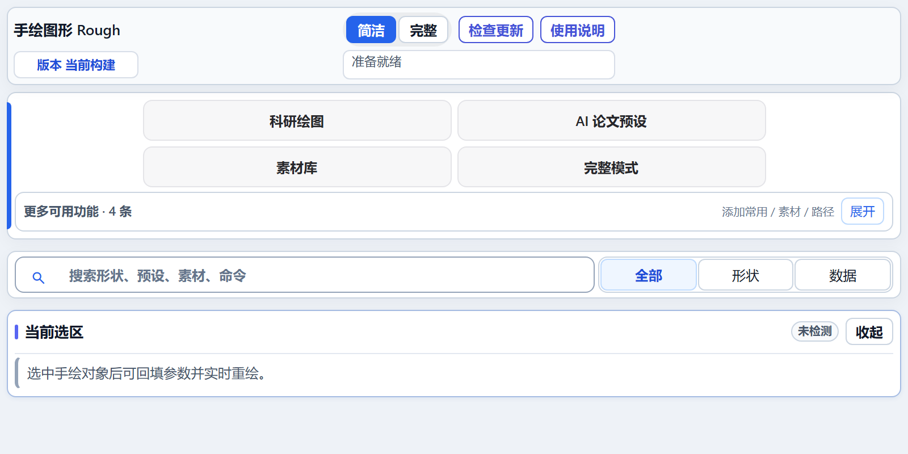
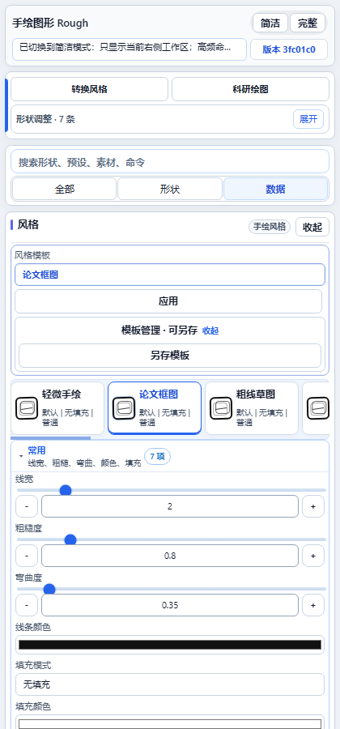
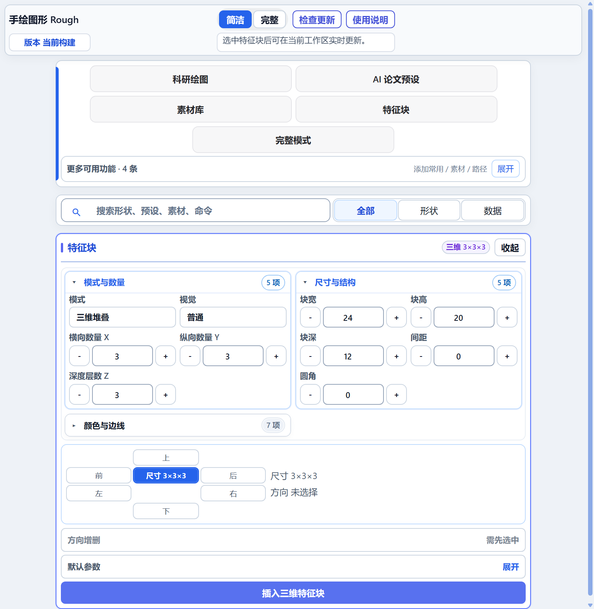
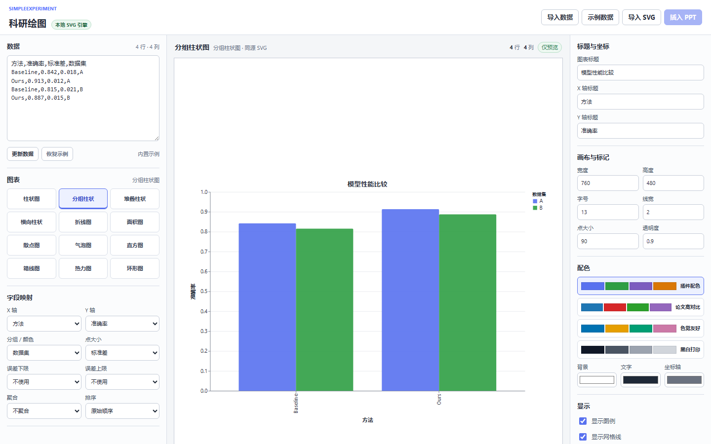

# Rough PPT Add-in 使用说明

这份说明面向公开使用者，介绍兼容环境、安装方式、每个功能区的用途和常见问题。安装后的插件右上角也有同一个主题的离线“使用说明”；该说明会显示为独立非模态窗口，可以边阅读边操作 PowerPoint。

## 目录

- [快速开始](#快速开始)
- [功能入口总览](#功能入口总览)
- [手绘图形](#手绘图形)
- [风格、模板与实时重绘](#风格模板与实时重绘)
- [二维与三维特征块](#二维与三维特征块)
- [科研绘图](#科研绘图)
- [论文套件与结构预设](#论文套件与结构预设)
- [素材、论文图像与配色](#素材论文图像与配色)
- [SimpleExperiment 与外部联动](#simpleexperiment-与外部联动)
- [兼容性、安装与排障](#兼容性安装与排障)
- [更新与卸载](#更新与卸载)

## 快速开始

1. 打开桌面版 PowerPoint，进入 Ribbon 中的“手绘图形 Rough”选项卡。
2. 需要精确参数或资源管理时，打开右侧任务窗格。
3. 新建对象时使用 Ribbon 的“形状图库”；已有普通形状则选中后点击“转换手绘”。
4. 选中普通形状、手绘组或特征块后，简洁模式只会显示当前上下文可用的功能。
5. 修改右侧参数或 Ribbon 快捷项后，选中的手绘对象会立即重绘。
6. 把常用结果保存到“我的素材”，或把常用形状固定到快速插入栏。

简洁模式的顶部搜索可用于定位形状、预设、素材、配色和命令。没有选中对象时，插件不展示参数调整区；只有选中可处理的对象后才显示对应工作区。

## 功能入口总览

Ribbon 保留五个稳定分组，避免同一能力散落在多个下拉菜单里：

| 分组 | 用途 |
| --- | --- |
| 常用 | 形状图库、转换手绘、重绘选区、选择载体、检查选区、功能搜索和右侧窗格 |
| 快速插入 | 直接显示已固定的常用形状，并提供一个管理入口 |
| 风格 | 风格模板、组合样式、填充和线条 |
| 论文与特征 | 论文套件、二维/三维特征块、常用预设、方向调整和默认值保存 |
| 素材 | 保存素材、最近素材、刷新、导入、分享和打开 Zotero 完整论文图片库 |

少于五项的功能直接排列在 Ribbon 中；只有至少五项的集合才使用菜单收纳。右侧任务窗格负责大面积预览、精确参数、搜索、资源管理和兜底操作。定位类入口只跳转到对应工作区，不会直接执行删除、导入、转换或重绘。

顶栏可在“简洁”和“完整”之间切换：

- **简洁模式**根据无选区、普通对象、手绘组或特征块选区过滤面板。
- **完整模式**显示全部专业面板，用于跨功能浏览和高级资源管理。
- 任务窗格宽度变化时，控件使用 flex/grid 流式布局自动换行或滚动，避免互相覆盖。

## 手绘图形

### 插入新形状

1. 打开“手绘图形 Rough”选项卡。
2. 从形状图库按类别选择形状，或使用直线、箭头、矩形、椭圆等高频入口。
3. 插件按当前风格生成 PowerPoint 原生对象组。

可见手绘笔画是一个或多个 `Freeform`，外层是不可见的原生交互载体。整组对象可以正常参与选择、对齐、缩放、旋转、复制、层级调整和再次分组。

### 转换已有对象

1. 在幻灯片中选择一个或多个普通 PowerPoint 形状。
2. 点击 Ribbon 的“转换手绘”。
3. 已是合规手绘组的对象会自动跳过。
4. 转换后在右侧“风格”中精调，必要时用“重绘选区”重建边界。

### 当前选区动作

| 动作 | 用途 |
| --- | --- |
| 重绘选区 | 按当前尺寸、调整点和风格参数重新生成手绘视觉，不新建幽灵对象 |
| 选择载体 | 选中组内隐藏的原生载体，便于用 PowerPoint 调整点改变圆角、箭头等几何 |
| 检查选区 | 查看原生对象、图层角色和重绘元数据，用于判断异常来源 |
| 保存素材 | 将当前选中的原生对象保存到本机素材库，之后跨演示文稿复用 |

## 风格、模板与实时重绘

选中普通对象或手绘组后，简洁模式自动进入风格工作区。模板控制一整组参数；手动修改任一参数后会退出模板选中态，避免误以为仍在使用完整模板。

| 参数组 | 能力 |
| --- | --- |
| 风格模板 | 应用轻微手绘、论文框图、粗线草图等预置方案；自定义模板可保存、重命名和管理 |
| 边界与扰动 | 线宽、粗糙度、弯曲度、随机种子、普通边界、二层或三层嵌套及嵌套错位方向 |
| 填充 | 无填充、纯色、白底、涂刷、斜线、交叉、点状、短划、锯齿等 |
| 线条与箭头 | 实线、虚线、点线、点划线，多种粗细、单向/双向箭头和头型 |
| 视觉来源 | Rough.js、Excalidraw、draw.io、D2、tldraw 等边界或填充风格来源 |

### 单独调整手绘箭头三角形

1. 选中手绘箭头组，展开右侧“风格”中的“线条”。未选中手绘对象时参数区不会显示。
2. 将“箭头”设为“手绘箭头”。
3. “箭头长度”控制沿线方向的三角形长度，范围为 4–40 磅，默认 14 磅。
4. “箭头宽度”控制垂直方向的三角形宽度，范围为 4–32 磅，默认 10 磅。
5. 拖动任一滑杆都会实时重绘当前选区；短线会自动限制箭头长度，避免三角形越过线段。

Ribbon 的风格模板同样同步重绘已选中的手绘对象。未选中可重绘对象时，只更新后续插入默认值和当前面板参数。

## 二维与三维特征块

特征块用于表示卷积特征图、图像 Patch、张量、体数据、注意力图和中间层表示。Ribbon 放高频预设，右侧窗格提供完整参数。

- **模式与数量**：二维或三维，横向 X、纵向 Y、深度 Z。
- **尺寸与结构**：块宽、块高、块深、间距和圆角。
- **视觉**：普通或手绘模式、边线、起止颜色和渐变方向。
- **方向编辑**：左、右、上、下、前、后分别增加或删除一列、一行或一层。
- **预设**：二维 3×3、三维 3×3×3、手绘二维/三维、长条特征、注意力图、体数据块等。
- **默认参数**：保存当前配置后，后续插入会复用。

只有选中特征块后才显示参数和方向操作。低频方向按钮默认收起，减少首屏拥挤。

## 科研绘图

科研绘图主入口打开插件自带的本地中文工作台，不会自动跳转外部网站。CSV/TSV 由 Papa Parse 在本机解析，图表由 Vega Lite 生成，预览和 PowerPoint 插入复用同一条 SVG 字符串，因此颜色、坐标轴、文字和布局保持一致。

### 标准流程

1. 点击右侧“科研绘图”。
2. 粘贴数据，或点击“导入数据”读取 CSV、TSV、TXT。
3. 使用包含、等于、不等于、大于或小于条件筛选数据。
4. 搜索或按类别选择 36 种图表之一。
5. 设置 X/Y、分组、分面、点大小、误差上下限、聚合与排序。
6. 调整坐标尺度、范围、刻度格式、反转、参考线、误差带、注释、画布和配色；每次修改都会实时刷新。
7. 点击“保存配置”复用样式；原始数据不会写入配置。
8. 预览生成并通过宿主校验后，点击“插入 PPT”，SVG 会等比居中插入当前幻灯片。

### 图表能力

| 类别 | 示例 |
| --- | --- |
| 基础比较 | 柱状、分组柱状、堆叠柱状、横向柱状、折线、阶梯、面积、散点、气泡、直方 |
| 分布 | 箱线、密度、小提琴、雨云、山脊、经验累积分布、条带 |
| 统计关系 | 回归、Q-Q、P-P、森林、相关矩阵、并行坐标、三元、雷达 |
| 模型评估 | ROC、精确率召回、校准、Bland–Altman、火山、漏斗 |
| 生存分析 | Kaplan–Meier 生存曲线、累计风险 |
| 组成与极坐标 | 热力、环形、极坐标 |

其他能力包括分面、多变量探索、分布诊断、SVG 导入、SVG 下载和配置恢复。默认配色沿用 SIMPLEEXPERIMENT 插件配色，也可切换论文高对比、色觉友好或黑白打印方案。

RAWGraphs、Datawrapper、Plotly Chart Studio 和 Vega Editor 收纳在外部工具折叠区。只有用户明确点击具体网站按钮时才会通过系统浏览器打开固定 HTTPS 地址。

### SVG 安全边界

- 本地生成或导入的 SVG 上限为 4 MB。
- 文本必须使用严格 UTF-8 编码。
- 拒绝脚本、事件处理器、动画、嵌入图像、处理指令、外部 URL 和外部样式资源。
- 禁止 DTD 和外部 XML 解析器。
- 内容先暂存到本机会话文件，插入前再次校验 SHA256，确保预览与幻灯片内容一致。

旧任务窗格导入面板继续处理统计 JSON、CSV、论文表格和 SimpleExperiment 自动化结果，并保持 PowerPoint 原生对象输出。科研 SVG 直接插入只在 PowerPoint 2016 及以上可用；PowerPoint 2013 应使用旧原生绘图链路。

## 论文套件与结构预设

论文套件用于快速搭建可编辑框图骨架，而不是复刻单篇论文图片。Ribbon 放一键预设，右侧窗格提供分类、收藏和大面积预览。

常用类别包括：

- 论文节点、数据节点、判断节点、分组虚线、高亮框和粗箭头。
- Transformer 编码器/解码器、视觉编码器、文本编码器和多模态融合。
- 对比学习双塔、注意力机制、Q-Former、VLM、RAG 和大模型诊断流程。
- 医学分割、报告生成、临床验证、联邦学习、生存分析和主动学习。
- MoE 专家路由、纵向随访、弱监督 MIL、知识图谱、教师学生蒸馏。
- 论文矩阵、体数据块、注意力图和诊断评估面板。

预设插入的是 PowerPoint 原生组；文字、颜色、尺寸和连线都可以继续修改。预览仅用于选择，最终对象不是预览截图。

## 素材、论文图像与配色

### 我的素材

- 保存当前选区，并保留 PowerPoint 原生对象结构。
- 按名称搜索、插入、重命名、删除、批量选择和刷新。
- 使用安全分享包导出或导入选定素材。
- 导入时按原生 PPT 模板内容检测重复，跳过已有素材和包内重复项，并显示导入数与跳过数。
- 删除、重命名和移除使用悬浮确认气泡；确认后不改变页面滚动位置，可继续原工作流。

### Zotero 论文图像

| 入口 | 适用场景 |
| --- | --- |
| Ribbon → 素材 → 打开论文图片库 | 浏览 Zotero 生成的完整图库、筛选排序、高清查看、批量选择、分享、导入和删除 |
| 右侧 → 论文图像与配色 | 快速搜索、预览、取色、插入当前参考图和查看溯源信息 |

完整图库界面由 Zotero 维护。PPT 只复用它生成的页面，不复制第二套完整图库。右侧快速选择器读取本机共享 SQLite，因此 Zotero 未运行时仍可预览、取色和插图。

插件只读 `%LOCALAPPDATA%\ZLK\paper-image-library\paper_images.sqlite`，不读取 Zotero 内部 `zotero.sqlite` 或其旁车文件。定位原 PDF 失败时，插件不会执行非法 URI，只复制溯源 ID。

### 配色库

1. 在论文图像卡片点击“设为配色参考”。
2. 配色区显示当前单张图片实际提取出的全部颜色；数量由图片决定，不固定为 5 色，也不会累积多张图的颜色。
3. 当前配色未保存时，切换另一张参考图会出现页面内悬浮确认。取消则停留在当前图，确认后才读取新图。
4. 可勾选“本次 PowerPoint 会话不再询问”。该选项只保存在当前会话内存；重启 PowerPoint 后仍会询问。
5. 点击“保存当前配色”后，当前参考图标记为已保存，之后切换图片不再被未保存状态阻止。

其它配色来源包括剪贴板、当前页、PowerPoint 主题和用户保存配色。整体映射前可预览颜色布局，避免只替换少量颜色导致失衡。配色支持保存、重命名、删除、分享和导入。

## SimpleExperiment 与外部联动

插件可作为本机科研绘图终端接收 SIMPLEEXPERIMENT 请求，并保留旧 ZLK Cluster 协议兼容端点。联动服务只监听本机回环地址，并使用本机令牌鉴权。

1. PowerPoint 加载插件后，在本机应用数据目录发布自动化发现信息和令牌。
2. SIMPLEEXPERIMENT 通过本机接口提交轻量绘图请求。
3. 插件复用已打开目标演示文稿，或在允许时创建并保存新文稿。
4. 结果经前端归一化后绘制为 PowerPoint 原生 Shape、Line、Textbox、Table 或 Group。
5. 服务不会关闭已有 PPT，也不会退出 PowerPoint。

相同 `requestId` 的成功请求在响应丢失后可直接重放，不会重复创建页面；同一 ID 携带不同内容会收到明确的中文冲突提示。

## 兼容性、安装与排障

### 推荐环境

- Windows 10 或 Windows 11。
- 桌面版 PowerPoint 2013、2016、2019、2021、2024 或 Microsoft 365。
- .NET Framework 4.8。
- Visual Studio Tools for Office Runtime。
- Microsoft Edge WebView2 Evergreen Runtime。
- 32 位或 64 位桌面 Office。

不支持 PowerPoint 网页版、macOS 版和移动版 Office。科研 SVG 直接插入需要 PowerPoint 2016 及以上。

详细安装方式见根目录 [`../README.md`](../README.md)。三种安装包都会检查必要环境；安装器不会自动关闭 PowerPoint。

### 安装后看不到插件

1. 点击右侧顶部“版本检测”，核对安装版本、提交和构建时间。
2. 打开 PowerPoint 的“文件 → 选项 → 加载项 → COM 加载项”，确认 `RoughPptAddin` 已启用。
3. 如果安装时 PowerPoint 正在运行，保存并完全退出后重新打开 PowerPoint。
4. 必要时重新运行同一版安装器，让它替换旧载荷。

### 按钮不可用或参数未显示

- 简洁模式按选区过滤功能，这是有意设计。
- 无选区时先选择普通形状、手绘组或特征块。
- 普通对象可转换手绘；手绘组可重绘和调风格；特征块只显示自己的参数。
- 需要浏览全部能力时切换“完整”模式，或使用顶部搜索。

### 科研绘图或 Zotero 未连接

- 先查看右侧连接状态和中文错误提示。
- 自动绘图只接受本机回环连接和正确令牌。
- Zotero 图像库必须位于约定的本机共享数据库路径。
- SVG 插入失败时检查文件是否小于 4 MB、是否 UTF-8、是否包含禁用资源，以及 PowerPoint 是否为 2016 以上。
- 连接失败不影响普通手绘图形、特征块、模板和本机素材功能。

## 更新与卸载

### 更新

1. 点击“版本检测”记录当前提交和构建时间。
2. 到 GitHub Releases 下载较新的 ZIP、MSI 或 EXE。
3. 保存并关闭全部 PowerPoint 窗口。
4. 运行新版安装器；安装事务会替换旧载荷，失败时恢复回滚目录。
5. 重新打开 PowerPoint，再次核对版本信息。

### 普通卸载

运行 `Uninstall-RoughPptAddin.cmd`。它会移除 PowerPoint 注册项和程序载荷，但保留用户素材、缩略图、配色、预设、导出和日志。

### 完整卸载

运行 `Complete-Uninstall-RoughPptAddin.cmd`。该操作会永久删除插件专属数据，包括：

- `%LOCALAPPDATA%\RoughPptAddin`
- `%USERPROFILE%\Documents\RoughPptAddin`
- `%LOCALAPPDATA%\RoughPptAddinInstaller`
- 插件专属开发证书
- 受限临时目录、日志、WebView2 状态和自动化令牌

完整卸载不会删除 Zotero 共享图库，也不会卸载系统共享的 WebView2、VSTO Runtime 或 .NET Framework。执行前必须关闭全部 PowerPoint 窗口。
